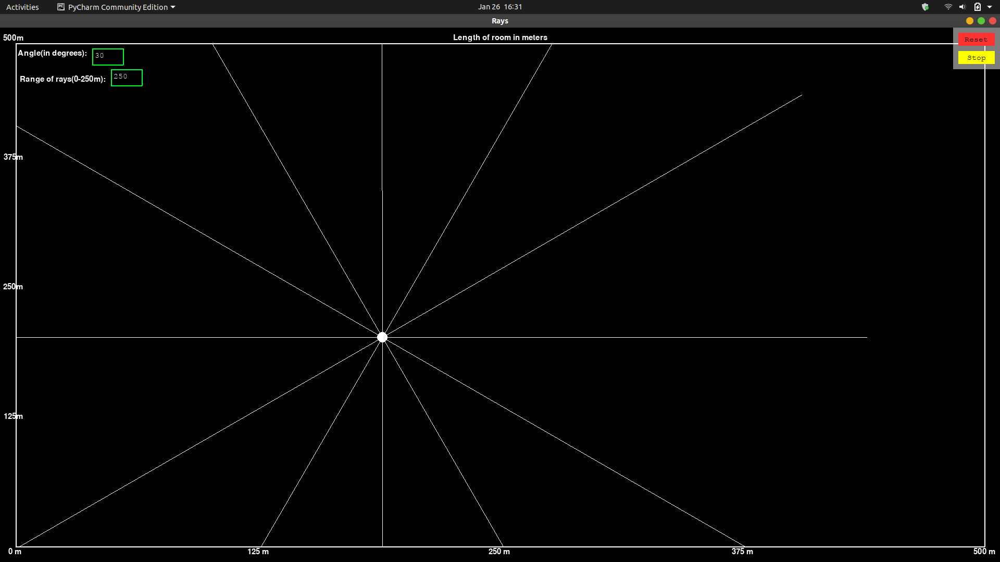

# lidar_visualizer
a tool to visualize or simulate lidar.There are two ways to run this visualizer.One way is python and the other next is web browser.
# PYTHON WAY:
## Requirements
- `python 3.5+`
- pygame `pip install pygame`

## Usage
- Run `python3 main.py` in script directory

## Showcase

#### Building walls
To build a wall you have to press left mouse button to set starting position for a wall, select ending point and press left mouse button again. To cancel drawing a wall press right mouse button. **You can't draw walls while playing**

#### Playing
Press Play button in upper-right corner and move your mouse around to change a location of the source of light.

You can stop the game and add more walls if you want.
#### Typing Angles
To add angle to your ray you must press the green box beside the angle(in degrees) and box will turn white. After typing(angle between 0 to 360), __Press Enter or Keypad Enter__. If angle is written in string or in float the box will not accept the angle.

#### Range of rays
To add length of rays you should press the green box beside the range of rays(in metres) and box will turn white.After typing(length between 0 to 250m),__Press Enter or Keypad Enter__. If length is written in string or in float the box will not accept the length.

#### Reset
If you want to reset the map just press Reset Button

_Original Code can be found on this https://github.com/kubapilch/Ray-Tracing_
# THROUGH WEB:
  ## Requirements
  -   `BROWSER`
  ##  Usage
  -  run `index.html` on your browser.
  
  ## Showcase
  
  ### Building Walls
  To build a wall you have to touch and press left mouse button till you reach the end point and then leave it.
   **You can't draw walls while playing.**
   
   <image src='images/walls.png'>
 
 ### Angles
 To add angle tyoe in the input box given on the upper side of the screen.
 
 <image src='images/angle.png'>
 
 ### Range of rays
 To add range of rays type in the inout box given on the upper right of the screen.
 
 <image src='images/range.png'>
  
  
    
